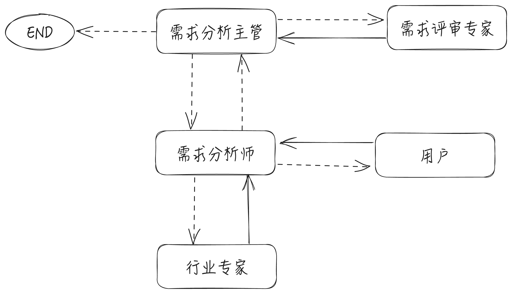

# 需求分析助手

## 项目简介

本项目是一个基于 Langchain 和 LangGraph 框架的多 Agent 协作的交互式需求分析助手，前端界面使用 Chainlit 框架构建。

### LangGraph 图结构：


#### 节点说明：
- 需求分析主管：负责把控需求分析流程，分派任务。
- 需求分析师：负责与用户对话，完成需求分析工作。
- 行业专家：负责向需求分析师提供知识和建议。
- 需求评审专家：负责评审需求，并给出改进的建议。
- 用户：人类扮演的需求分析受访者。

### 文件结构

```
.
├── public 
├── ra_graph
│   ├── analyst.py：需求分析师 chain
│   ├── expert.py：行业专家 agent
│   ├── human.py：用户 chain
│   ├── ra_graph.py：需求分析 graph
│   ├── reviewer.py：需求评审专家 chain
│   └── supervisor.py：需求分析主管 chain
├── server
│   ├── .chainlit：chainlit 配置文件夹
│   ├── .files
│   ├── chainlit.md：欢迎页面
│   └── ra_graph_app.py：chainlit 前端界面
├── tools
│   └── agent_tools.py：Agent可用工具
└── requirements.txt
```

## Quickstart

### 克隆项目到本地

```shell
git clone https://github.com/0xHyde/RequirementAnalystGraph.git
cd RequirementAnalystGraph
```

### 安装依赖
使用 pip 安装项目依赖

```shell
pip install -r requirements.txt
```

### 创建``.env``

在项目根目录创建``.env``文件，填写以下内容，并填入你的 API KEY


### 运行项目

进入 server 文件夹

```shell
cd server
```

运行项目

```shell
chainlit run ra_graph_app.py
```
